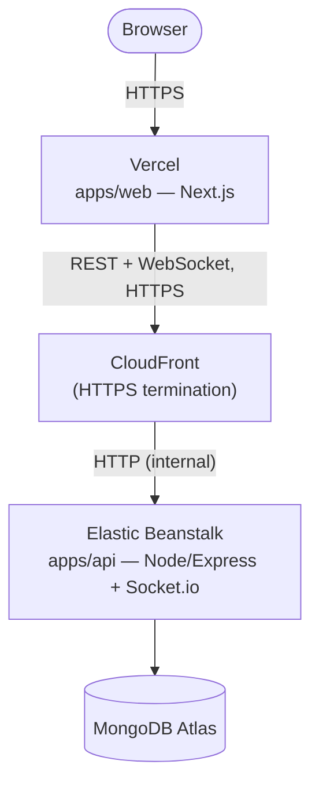
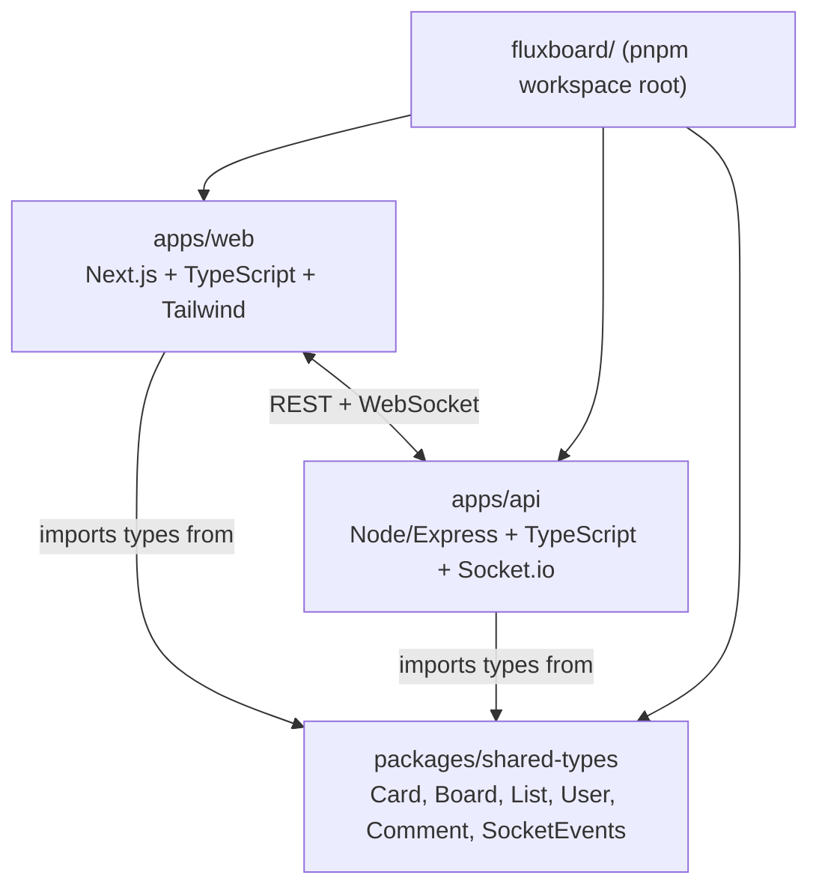

# fluxboard

A real-time collaborative Kanban board — Trello-style boards, lists, and
cards with live multi-user sync, granular permissions, and shareable invite
links. Built as a clean, well-structured full-stack TypeScript monorepo,
not a distributed-systems showcase (see
[`resilient-stack`](https://github.com/Lajat/resilient-stack) for that side
of the portfolio instead).

**Live:** [fluxboard.vercel.app](https://fluxboard.vercel.app)

## Features

- **Auth** — signup/login/refresh via httpOnly JWT cookies, forgot/reset
  password
- **Workspaces** — create a workspace, invite teammates via a shareable
  link, owner-controlled membership
- **Granular permissions** — per-member `canAdd`/`canEdit`/`canDelete`,
  independently settable by the workspace owner (not just a binary
  member/owner split)
- **Boards → Lists → Cards** — full CRUD, drag-and-drop reordering both
  within a list and across lists, with a database-level guard against a
  card ending up recorded in two lists at once
- **Card details** — description, due date (can't be set in the past),
  color labels, priority, assignee, a short human-readable id (e.g. `TT-7`)
- **Comments** — a discussion thread on every card
- **Real-time sync** — every mutation (card moved, list reordered, comment
  added, workspace deleted, member removed, etc.) is broadcast live to
  everyone affected — not just people currently viewing the same board,
  but anyone signed in whose sidebar or workspace list needs to reflect it
- **Responsive** — a proper mobile layout, not just a squeezed desktop one

## Architecture



**Why CloudFront sits in front of the API:** Elastic Beanstalk's own domain
only serves plain HTTP. Since the frontend is on Vercel over HTTPS, a
browser refuses to let an HTTPS page call an HTTP API at all (mixed-content
blocking) — CloudFront terminates HTTPS at the edge and talks plain HTTP to
Elastic Beanstalk internally, which the browser never sees.

**Auth cookies and cross-site requests:** the frontend and backend are on
different registrable domains (`vercel.app` vs. `cloudfront.net`), which
makes every API call a cross-site request from the browser's point of
view. Auth cookies use `sameSite: "none"` in production specifically for
this reason — `"lax"`/`"strict"` both silently block a cookie on
cross-site `fetch()` calls, which is a real bug this project hit and fixed
(see [`BLOG_POST_DRAFT.md`](./BLOG_POST_DRAFT.md) for a related one).
`NODE_ENV=production` is baked into the Docker image itself, not left as
an Elastic Beanstalk console setting, since this cookie behavior depends
on it entirely.

## Real-time event scoping

Not every real-time event is scoped the same way, and getting this wrong
was the source of two real bugs (a newly created board never appearing in
the sidebar, and a deleted workspace staying stale there too):

```mermaid
flowchart LR
    subgraph Board room
        A["card:moved<br/>card:created<br/>comment:added"]
    end
    subgraph Workspace room
        B["board:created<br/>board:deleted"]
    end
    subgraph Personal room<br/>(user:userId)
        C["member:added<br/>access:revoked<br/>workspace:deleted"]
    end
```

- **Board-room events** reach anyone with that specific board open.
- **Workspace-room events** reach anyone viewing that workspace's
  board-list page.
- **Personal-room events** reach a specific user's own connection,
  regardless of what page they're currently on — necessary for anything
  that should update a component like the sidebar, which never joins a
  workspace's room at all unless you're actively looking at it.

## Monorepo structure



`Card`, `Board`, `List`, `Comment`, and every real-time event name are
defined **once**, in `packages/shared-types`, and imported by both the
frontend and the backend. A type change on one side is a compile error on
the other if they've drifted — not a runtime bug discovered later.

## Tech stack

| Layer | Choice |
|---|---|
| Frontend | Next.js (App Router) + TypeScript + Tailwind CSS |
| Drag & drop | `dnd-kit` |
| Backend | Node.js + Express + TypeScript |
| Real-time | Socket.io |
| Database | MongoDB Atlas (Mongoose) |
| Auth | JWT in httpOnly cookies (access + refresh) |
| Deploy | Vercel (frontend) · AWS Elastic Beanstalk + CloudFront (backend) |
| CI/CD | GitHub Actions — build, typecheck, integration tests, auto-deploy |
| Monorepo tooling | pnpm workspaces + Turborepo |

## Getting started

```bash
pnpm install
cp apps/api/.env.example apps/api/.env   # fill in MongoDB URI + JWT secrets
cp apps/web/.env.example apps/web/.env
pnpm dev        # runs both apps/web and apps/api in parallel via Turborepo
```

## What's intentionally not built

- File attachments on cards
- Dragging to reorder lists themselves (only cards are draggable; column
  order is fixed)
- Real-time cursors/presence indicators (you can see changes as they
  happen, but not who's currently looking at what)

## License

MIT — see [`LICENSE`](./LICENSE).
