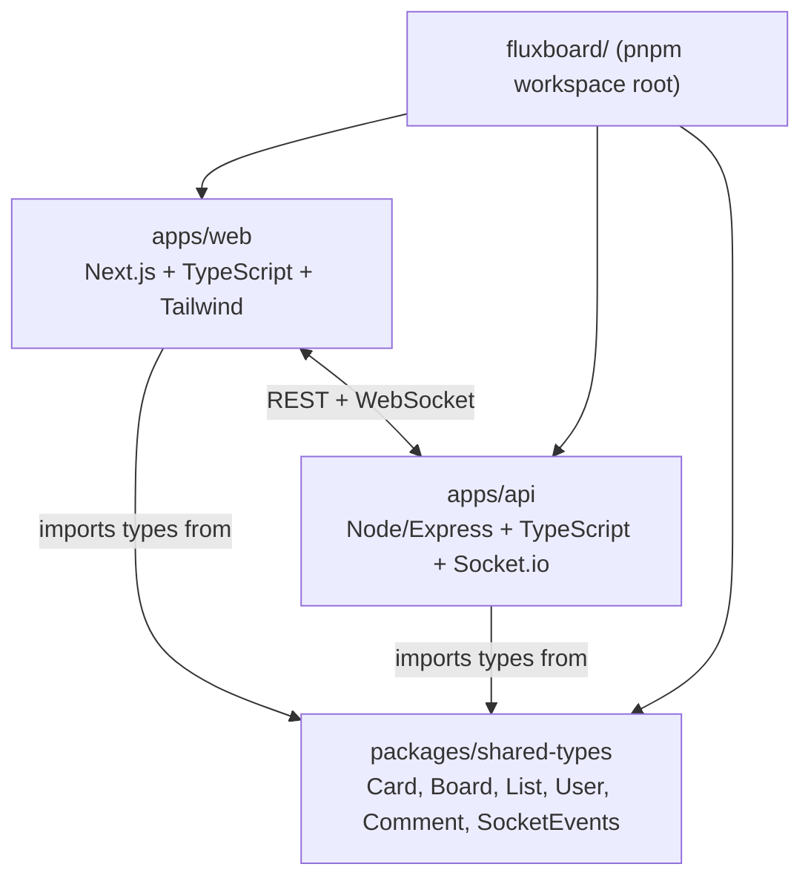
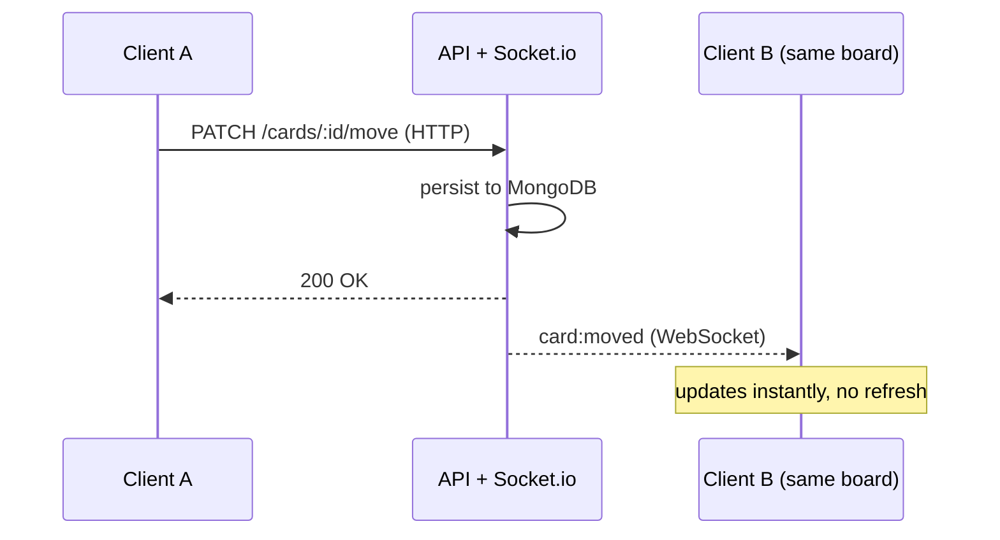

# fluxboard

A real-time collaborative Kanban board — Trello-style boards, lists, and
cards with live multi-user sync. Built as a clean, well-structured
full-stack TypeScript monorepo, not a distributed-systems showcase (see
[`resilient-stack`](https://github.com/Lajat/resilient-stack) for that side
of the portfolio instead).

**Live:** [fluxboard.vercel.app](https://fluxboard.vercel.app)

## Features

- **Auth** — signup/login/refresh via JWT, forgot/reset password
- **Workspaces** — create a workspace, invite teammates via a shareable
  link, owner-controlled membership
- **Boards → Lists → Cards** — full CRUD, drag-and-drop reordering both
  within a list and across lists
- **Card details** — description, due date, color labels, priority,
  assignee
- **Comments** — a discussion thread on every card
- **Real-time sync** — every mutation (card moved, list reordered, comment
  added, etc.) is broadcast live to everyone else viewing the same board

## Architecture


**Why CloudFront sits in front of the API:** Elastic Beanstalk's own domain
only serves plain HTTP. Since the frontend is on Vercel over HTTPS, a
browser refuses to let an HTTPS page call an HTTP API at all (mixed-content
blocking) — CloudFront terminates HTTPS at the edge and talks plain HTTP to
Elastic Beanstalk internally, which the browser never sees.

## Monorepo structure



`Card`, `Board`, `List`, `Comment`, and every real-time event name are
defined **once**, in `packages/shared-types`, and imported by both the
frontend and the backend. A type change on one side is a compile error on
the other if they've drifted — not a runtime bug discovered later.

## Real-time event flow



## Tech stack

| Layer | Choice |
|---|---|
| Frontend | Next.js (App Router) + TypeScript + Tailwind CSS |
| Drag & drop | `dnd-kit` |
| Backend | Node.js + Express + TypeScript |
| Real-time | Socket.io |
| Database | MongoDB Atlas (Mongoose) |
| Auth | JWT (access + refresh tokens) |
| Deploy | Vercel (frontend) · AWS Elastic Beanstalk + CloudFront (backend) |
| CI/CD | GitHub Actions — build, typecheck, integration test, auto-deploy on push to `main` |
| Monorepo tooling | pnpm workspaces + Turborepo |

## Getting started

```bash
pnpm install
cp apps/api/.env.example apps/api/.env   # fill in MongoDB URI + JWT secrets
cp apps/web/.env.example apps/web/.env
pnpm dev        # runs both apps/web and apps/api in parallel via Turborepo
```

## A real bug worth mentioning

While testing the real-time sync, creating a card briefly showed it
**twice** in the tab that created it (other tabs only ever saw it once).
Root cause: the backend emits the Socket.io broadcast *before* sending the
HTTP response, so the WebSocket push can reach the browser before its own
`fetch()` call resolves — the creating tab then added the card twice: once
from the socket event, once from its own success handler. Fixed by making
every local state update idempotent (check "is this already here?" before
inserting), the same discipline already used for cross-tab sync — the bug
was that two of the four mutation handlers didn't have that check yet.

## What's intentionally not built

- Role-based permissions beyond "owner vs. member" (RBAC was scoped out
  early as a stretch goal, not an oversight)
- File attachments on cards
- Dragging to reorder lists themselves (only cards are draggable; column
  order is fixed)

## Access control

Every mutating endpoint (board, list, card, comment) checks the caller's
workspace membership and granular permission level (`canAdd`/`canEdit`/
`canDelete`, defined in `apps/api/src/lib/permissions.ts`) before acting —
including a guard in `moveCard` specifically preventing a card from being
dragged into a list on a *different* board, which would otherwise let a
crafted request exfiltrate a card out of its workspace.

